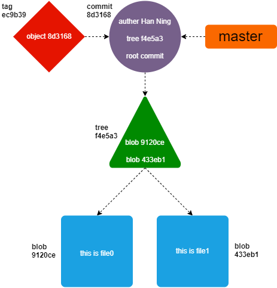
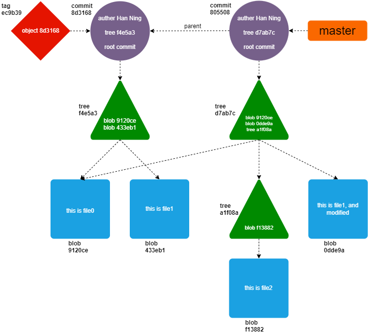
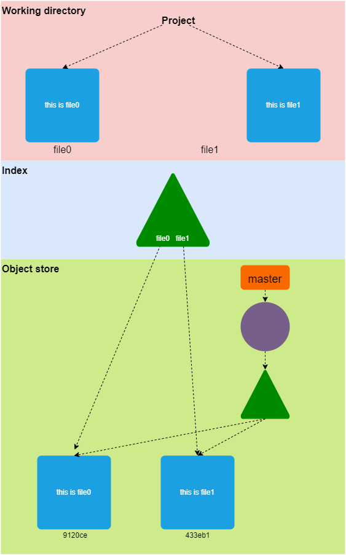
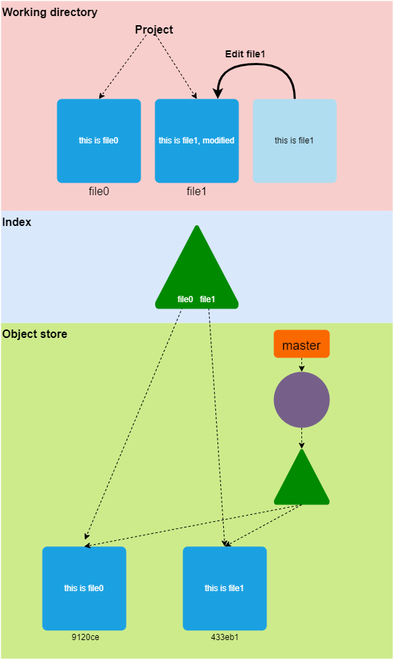
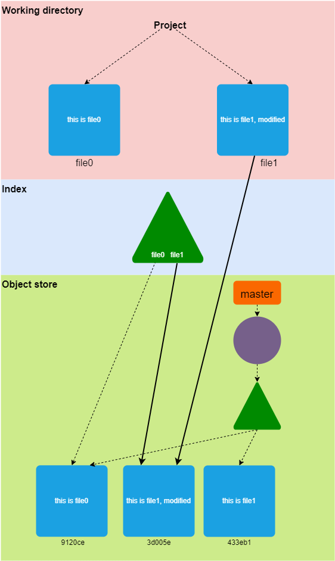
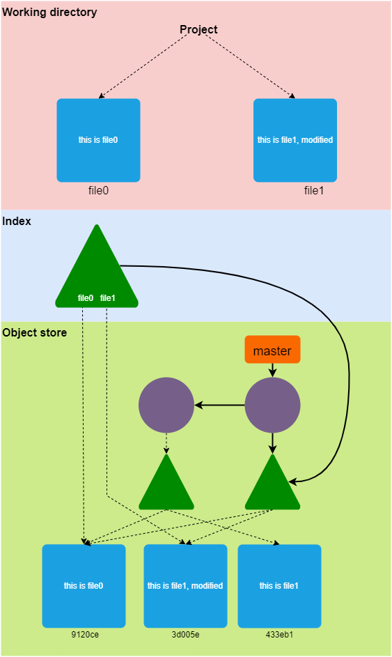
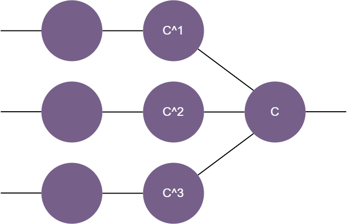
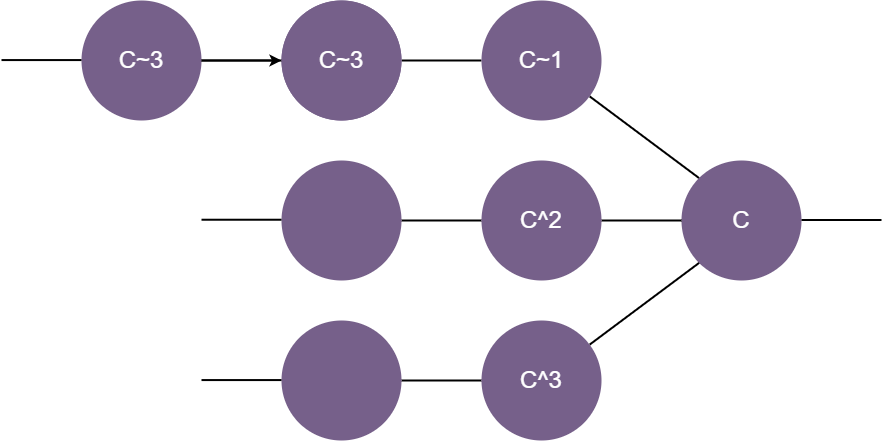
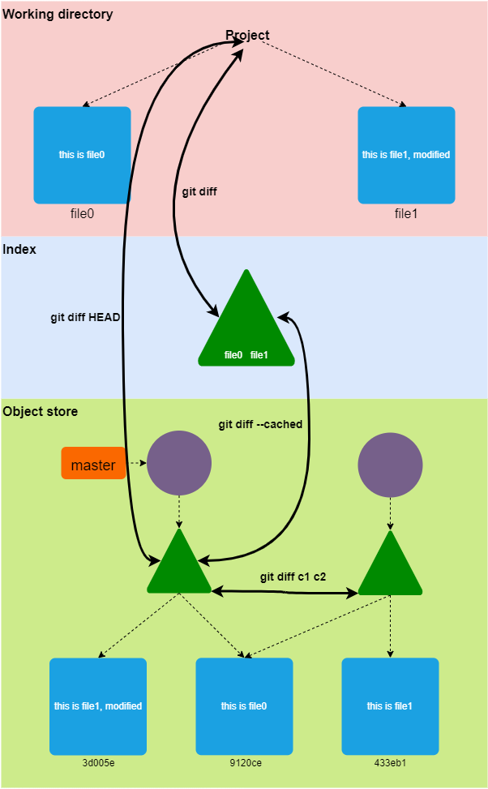
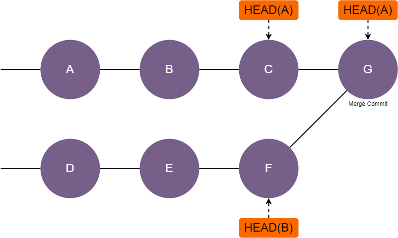

# Git

## 诞生背景

Git 的诞生和 Linux 内核的发展有着密不可分的联系。

大家都知道，Linux 内核项目目前使用 Git 来管理项目代码。在 Git 诞生之前，Linux 内核社区使用商业软件公司开发的 BitKeeper 来管理内核代码。很长一段时间，BitKeeper 很好地胜任了这项任务。然而，2005 年春天，BitKeeper 所属公司在发布 "free as beer" 版本的 BitKeeper 时， 加入了额外的限制，这使得 Linux 社区意识到 BitKeeper 已经不再适合作为 Linux 内核代码的管理工具了。

Linus 曾尝试从开源社区种寻找 BitKeeper 的替代品, 但是没有找到一个完全符合他[要求](https://en.wikipedia.org/wiki/Git#Characteristics)的软件。因此，Linus 决定自己创造一个！

下面列出了 Git 诞生过程中一些重要的时间节点：

- 2005 年 4 月 3 日，Linus 开始开发 Git。
- 2005 年 4 月 6 日， Linus 对外宣布了 Git 项目。
- 2005 年 4 月 7 日，Git 实现了自举。
- 2005 年 4 月 16 日，Linus 把内核代码迁移到 Git 上管理，并创建了第一条内核代码提交记录(commit)。

```shell
commit e83c5163316f89bfbde7d9ab23ca2e25604af29
Author: Linus Torvalds <torvalds@ppc970.osdl.org>
Date:   Thu Apr 7 15:13:13 2005 -0700

Initial revision of "git", the information manager from hell
```

```shell
commit 1da177e4c3f41524e886b7f1b8a0c1fc7321cac2
Author: Linus Torvalds <torvalds@ppc970.osdl.org>
Date:   Sat Apr 16 15:20:36 2005 -0700

Linux-2.6.12-rc2

Initial git repository build. I'm not bothering with the full history,
even though we have it. We can create a separate "historical" git
archive of that later if we want to, and in the meantime it's about
3.2GB when imported into git - space that would just make the early
git days unnecessarily complicated, when we don't have a lot of good
infrastructure for it.

Let it rip!
```

## 关于 Git 的命名

Linus 曾讽刺地调侃过 git 这个名字（在英国英语俚语中意为 "不愉快的人"）。"我是个自负的混蛋，我以自己的名字命名所有的项目。首先是 'Linux'，现在是 'git'。Git 的手册里将 Git 描述为 "愚蠢的内容跟踪器"。Git 源代码的 read-me 文件是这样说的：

> "git "可以有任何含义，取决于你的心情。
>
> - 随机的三个字母组合，可以发音，但实际上没有任何常见的UNIX命令使用。它是 "get "的错误发音这一事实可能与此有关，也可能无关。
> - 愚蠢。可鄙和卑鄙。简单。从俚语词典中挑选吧。
> - "全球信息追踪器"：当你的心情不错，而且它真的对你有用。这时候天使在唱歌，一束光突然充满了房间。
> - ”满满一卡车的粪便“: 当它无法正确完成你的任务时。

## Git 版本库

Git 版本库是一个简单的数据库，包含了一个项目的所有数据的一份完整副本和管理一个项目的修改历史所需的所有信息。在 Git 中，和大多数版本控制系统一样，一个版本库在整个生命周期中都会包含整个项目的完整副本。然而，和大多数其他版本控制系统不同的是，Git 版本库不仅提供了版本库中所有文件的完整工作拷贝，而且还提供了版本库本身的拷贝。

Git 在每个版本库中都会维护一系列的配置信息。比如版本库用户的名字和电子邮件地址。和 Git 所管理的文件数据和其它元数据不同，这些配置信息是版本库本地所有的，不会随着克隆之类的操作而转移到其它位置。每个用户和版本库都可以独立配置本地的 Git 配置信息。

在一个版本库里，Git 维护着两个主要的数据结构，**对象存储**和**暂存区**。所有这些版本库数据都存储在你工作目录的根部，在一个名为 **.git** 的隐藏子目录中。

**对象存储**的设计使得数据在克隆等操作中可以被高效地复制，它也是支持全分布式版本控制机制的重要一部分。**暂存区**是过渡性信息，对存储库来说是私有的，可以根据需要创建或修改。

## Git 对象存储

Git 版本库实现的核心是对象存储。它包含了你的文件的原始数据和所有的日志信息、作者信息、日期，以及重建项目的任意版本或分支所需的其他信息。

Git 在对象存储中只存储四种类型的对象：**blobs**、**trees**、**commits** 和 **tags**。这四个原子对象构成了 Git 其它高层数据结构的基础。

> - **Blobs**
>
>   一个文件的每个版本都表示为一个 blob。Blob 是 "二进制大型对象(binary large object)" 的缩写，是一个在计算中常用的术语，指一些可以包含任何数据的变量或文件，其内部结构被程序所忽略。blob 被视为不透明的。blob 包含一个文件的数据，但不包含任何关于文件的元数据，甚至不包含其名称。
>
>   
>
> - **Trees**
>
>   一个 **tree** 对象代表一个层次的目录信息。它记录了一个目录中所有文件的 blob 标识符、路径名称和少许元数据。它还可以递归地引用其他（子）**tree** 对象，从而建立一个完整的文件和子目录的层次结构。
>   
>   
>   
> - **Commits**
>
>   一个 **commit** 对象包含引入版本库变更的元数据，包括作者、提交者、提交日期和日志信息。每个 **commit** 都指向一个 **tree** 对象，这个 **tree** 对象是 **commit** 被创建时版本库的一个完整的快照。初始 **commit**，或者叫根 **commit**，没有 **parent**。大多数 **commit** 都有一个 **parent commit** 对象。有些 **commit** 有多个 **parent commit**。
>
>   
>
> - **Tags**
>
>   **tag** 对象指向一个特定的对象，这个对象通常是一个 **commit**。 **tag** 的意义在于，给一个长的，难记的 hash ID 指定一个任意的，但是人类可读的名称。例如：虽然 *9da581d910c9c4ac93557ca4859e767f5caf5169* 指的是一个确切的、定义明确的提交，但一个更熟悉的 **tag** 名称如 *Ver-1.0-Alpha* 可能更有意义。

## 暂存区

暂存区是一个临时的、动态的二进制文件，描述了整个版本库的目录结构。具体来说，暂存区是项目整体结构在某个时间节点的快照。项目的状态可以由项目历史上任何一点的 **commit** 和 **tree** 来表示，也可以是你正在开发的状态。

Git 的一个关键、与众不同的特点是，它能让你有条不紊地、按部就班地改变暂存区的内容。暂存区使得你可以把增量开发和提交变更进行分离。

作为开发者，你可以通过执行 Git 命令对暂存区中的内容进行修改。这些修改通常是添加、删除或编辑一些文件或一组文件。暂存区会记录并保留这些更改，在你准备提交之前，这些更改都是安全的。你也可以删除或替换暂存区中的修改。因此，暂存区可以在你的控制下，从一个复杂的版本库状态逐渐过渡到另一个状态。

## 内容可寻址名称

Git 对象存储被组织和实现为一个内容可寻址的存储系统。具体来说，对象存储中的每个对象都有一个唯一的名字，这个名字是通过对对象内容使用 SHA1 安全散列算法获得的哈希值。因为一个对象的所有内容对哈希值都有影响，而且哈希值被认为对特定内容是唯一有效的，所以 SHA1 哈希值可以作为该对象在对象数据库中的唯一名称。一个文件的任何微小变化都会导致 SHA1 哈希值的变化，从而使该文件的新版本被单独暂存区。

## Git 追踪内容

Git 的对象存储是基于对象内容的哈希值计算，而不是基于文件布局中的文件或目录名称。因此，当 Git 将一个文件放入对象存储时，它是基于文件内容的哈希值，而不是文件的名称。事实上，Git 并不追踪文件或目录名，因为它们是以另一种方式与文件关联的。

如果两个独立的文件有完全相同的内容，不管是在相同还是不同的目录下，Git 都会将这些内容的单一副本作为一个 blob 存储在对象存储中。如果某个文件发生了变化，Git 会为其计算一个新的 SHA1 值，生成一个新的 blob 对象，并将新的 blob 添加到对象存储。原有的 blob 仍然被保留在对象存储中，用来表示发生变化前的文件。

其次，Git 的内部数据库高效地存储了每个文件的每个版本，而不是不同版本间的差异。因为 Git 使用一个文件的完整内容的哈希值作为该文件的名称，所以任何操作都必须基于文件内容的完整拷贝。

## 打包文件（Pack Files）

根据上面介绍的内容，Git 存储每个文件的每个版本的完整内容，这种设计看上去简直太低效了。事实并不是如此。Git 使用一种叫做打包文件(pack file)的存储机制来创建一个打包的文件。Git 首先找到内容相近的文件，并存储其中一个文件的内容，然后计算出其它文件相对于这个文件的差异，把这些差异数据存储起来。例如，你在某个文件中加入了一行，Git 会把新版本的文件的完整内容放入对象村粗，然后在打包文件中记录下“添加一行”这个信息。

## 对象存储全景图

我们来看下 Git 是如何把存储对象结合在一起构建出完整的版本控制系统的。

**blob** 是最底层的对象。**tree** 对象指向 **blob** 对象，**tree** 对象也可以指向其它 **tree** 对象。每个 **commit** 对象指向一个 **tree** 对象。每个 **tag** 对象最多指向一个 **commit** 对象。下面的图显示了各种对象间的关系。



上图表示的 Git 版本库中，只包含一个初始 commit，初始 commit 中加入了两个文件，两个文件都在版本库的顶层目录中。另外，还在初始 commit 上打了个 tag。

现在我们对这个 Git 版本库做一些修改。首先我们修改了一个文件，然后创建了一个目录，并且在目录中添加了一个文件。最后我们提交了这些更改。这时候，对象存储变成了下面图示的样子。



## Git 中文件的分类

Git 把文件分为三类，**tracked**, **ignored**, **untracked**。

- **Tracked**

  **Trached file** 指的是已经存在于版本库中的文件，或者存在于暂存区中的文件。我们可以通过 *git add somefile* 把文件变成 **tracked**.

- **Ignored**

  一个 **ignored** 的文件必须在版本库中明确声明不可见或被忽略，尽管它可能存在于你的工作目录中。一个软件项目往往会有大量的忽略文件。常见的 **ignored** 的文件包括临时文件、编译器输出，以及大多数在构建过程中自动生成的文件。Git 有一个默认的忽略文件列表，你也可以配置你的版本库中的 *.gitignore* 文件来识别其他文件。

- **Untracked**

  **Untracked** 文件是那些存在于你的工作目录中，但是不属于 **tracked** 和 **ignored** 的那些文件。

## 使用 git add

根据 Git 中文件的分类，如果一个文件属于 **untracked**，*git add* 把这个文件变成 **tracked** 状态。如果 **git add** 作用于一个目录，则怎么目录中的文件都会被变成 **tracked** 状态。 

## 对象模型详解

如果你已经熟悉了 Git 的常用操作。接下来我们用几张图来解释在这些操作后面发生了什么。 

第一张图显示的是一个干净的版本库，此时版本库中只有一个初始 **commit**, 初始 **commit** 包含了两个文件 *file0*, *file1*。



当我们修改了 *file1*, 这时候工作区（*working directory*）变成了下面这个样子。



通过 *git add file1* 把修改加入暂存区（*index*）。



通过 *git commit* 把暂存区中的修改提交到版本库。



## 提交的名称

我们把提交（commit）名称大致分为两类，绝对名称（absolute commit name）和相对名称（relateive  commit name）。

- 绝对名称：提交的哈希 ID 是绝对名称，一个哈希 ID 只能对应一个提交。每一个提交的哈希 ID 都是全局唯一的，不仅仅是在某个 Git 版本库中，而是在世界上所有 Git 版本库中都是唯一的。

- 相对名称：可以通过相对位置来表示某个提交。

  1. 上角标（^）： commit^ 或 commit^1 表示 commit 的第一个父提交。commit^^ 表示 commit 的第二个父提交，可以增加 ^ 的数量来表示第 N 个父提交。 commit^N 也表示 commit 的第 N 个父提交。

     

  2. 波浪线（~）：commit~ 和 commit~1 表示当前分支上 commit 的父提交。commit~~...(总共 N 个~)或者 commit~N 表示 commit 在当前分支上向前追溯 N 个父提交。

     

## 提交记录

查看提交记录的主要命令是 *git log*。*git log* 后面可以接上很多参数，下面介绍部分常用的参数。这些参数都可以独立使用，也可以根据情况组合使用。

- **--oneline**, 单行形式显示提交记录，方便在一屏上显示更多的提交记录。

  ```shell
  $git log --oneline
  53ab78cd6d5a (HEAD -> master, origin/master, origin/HEAD) Merge tag 'clk-fixes-for-linus' of git://git.kernel.org/pub/scm/linux/kernel/git/clk/linux
  5ee3d0015a4c Merge tag 'drm-fixes-2022-02-25' of git://anongit.freedesktop.org/drm/drm
  7ee022567bf9 Merge tag 'perf-tools-fixes-for-v5.17-2022-02-24' of git://git.kernel.org/pub/scm/linux/kernel/git/acme/linux
  1f840c0ef44b Merge tag 'for-linus' of git://git.kernel.org/pub/scm/virt/kvm/kvm
  d8152cfe2f21 Merge tag 'pci-v5.17-fixes-5' of git://git.kernel.org/pub/scm/linux/kernel/git/helgaas/pci
  f672ff91236b Merge tag 'net-5.17-rc6' of git://git.kernel.org/pub/scm/linux/kernel/git/netdev/net
  ecf8a99f4807 Merge tag 'drm-intel-fixes-2022-02-24' of git://anongit.freedesktop.org/drm/drm-intel into drm-fixes
  73878e5eb1bd Merge tag 'block-5.17-2022-02-24' of git://git.kernel.dk/linux-block
  3a5f59b17f9d Merge tag 'io_uring-5.17-2022-02-23' of git://git.kernel.dk/linux-block
  6c528f34ca36 Merge tag 'platform-drivers-x86-v5.17-4' of git://git.kernel.org/pub/scm/linux/kernel/git/pdx86/platform-drivers-x86
  42404d8f1c01 net: mv643xx_eth: process retval from of_get_mac_address
  e910a53fb4f2 KVM: x86: nSVM: disallow userspace setting of MSR_AMD64_TSC_RATIO to non default value when tsc scaling disabled
  6f3c1fc53d86 KVM: x86/mmu: make apf token non-zero to fix bug
  ...
  ```

- **--graph**, 图形化展示提交记录，方便查看提交的演进情况，例如不同分支之间的合并关系。建议和 *--oneline* 组合使用。

  ```shell
  $ git log --graph --oneline
  *   53ab78cd6d5a (HEAD -> master, origin/master, origin/HEAD) Merge tag 'clk-fixes-for-linus' of git://git.kernel.org/pub/scm/linux/kernel/git/clk/linux
  |\
  | * 2f0754f27a23 clk: jz4725b: fix mmc0 clock gating
  | * 3494894afff4 clk: qcom: gcc-msm8994: Remove NoC clocks
  * |   5ee3d0015a4c Merge tag 'drm-fixes-2022-02-25' of git://anongit.freedesktop.org/drm/drm
  |\ \
  | * \   ecf8a99f4807 Merge tag 'drm-intel-fixes-2022-02-24' of git://anongit.freedesktop.org/drm/drm-intel into drm-fixes
  | |\ \
  | | * | 28adef861233 drm/i915/dg2: Print PHY name properly on calibration error
  | | * | ec663bca9128 drm/i915: Fix bw atomic check when switching between SAGV vs. no SAGV
  | | * | afc189df6bcc drm/i915: Correctly populate use_sagv_wm for all pipes
  | | * | a40ee54e9a09 drm/i915: Disconnect PHYs left connected by BIOS on disabled ports
  | | * | 3f33364836aa drm/i915: Widen the QGV point mask
  | * | |   7c17b3d37f1f Merge tag 'amd-drm-fixes-5.17-2022-02-23' of https://gitlab.freedesktop.org/agd5f/linux into drm-fixes
  | |\ \ \
  | | * | | c1a66c3bc425 drm/amdgpu: check vm ready by amdgpu_vm->evicting flag
  | | * | | e2b993302f40 drm/amdgpu: bypass tiling flag check in virtual display case (v2)
  | | * | | 97c61e0b7c59 Revert "drm/amdgpu: add modifiers in amdgpu_vkms_plane_init()"
  ...
  ```

- **-N**, N 是一个整数，限制显示提交的个数。

  ```shell
  $ git log -1
  commit 53ab78cd6d5aba25575a7cfb95729336ba9497d8 (HEAD -> master, origin/master, origin/HEAD)
  Merge: 5ee3d0015a4c 2f0754f27a23
  Author: Linus Torvalds <torvalds@linux-foundation.org>
  Date:   Thu Feb 24 17:35:22 2022 -0800
  
      Merge tag 'clk-fixes-for-linus' of git://git.kernel.org/pub/scm/linux/kernel/git/clk/linux
  
      Pull clk fixes from Stephen Boyd:
       "A couple driver fixes in the clk subsystem
  
         - Fix a hang due to bad clk parent in the Ingenic jz4725b driver
  
         - Fix SD controllers on Qualcomm MSM8994 SoCs by removing clks that
           shouldn't be touched"
  
      * tag 'clk-fixes-for-linus' of git://git.kernel.org/pub/scm/linux/kernel/git/clk/linux:
        clk: jz4725b: fix mmc0 clock gating
        clk: qcom: gcc-msm8994: Remove NoC clocks
  ```

- **-p**, 显示提交所对应文件的具体修改。

  ```shell
  $ git log -p
  commit 42404d8f1c01861b22ccfa1d70f950242720ae57
  Author: Mauri Sandberg <maukka@ext.kapsi.fi>
  Date:   Wed Feb 23 16:23:37 2022 +0200
  
      net: mv643xx_eth: process retval from of_get_mac_address
  
      Obtaining a MAC address may be deferred in cases when the MAC is stored
      in an NVMEM block, for example, and it may not be ready upon the first
      retrieval attempt and return EPROBE_DEFER.
  
      It is also possible that a port that does not rely on NVMEM has been
      already created when getting the defer request. Thus, also the resources
      allocated previously must be freed when doing a roll-back.
  
      Fixes: 76723bca2802 ("net: mv643xx_eth: add DT parsing support")
      Signed-off-by: Mauri Sandberg <maukka@ext.kapsi.fi>
      Reviewed-by: Andrew Lunn <andrew@lunn.ch>
      Link: https://lore.kernel.org/r/20220223142337.41757-1-maukka@ext.kapsi.fi
      Signed-off-by: Jakub Kicinski <kuba@kernel.org>
  
  diff --git a/drivers/net/ethernet/marvell/mv643xx_eth.c b/drivers/net/ethernet/marvell/mv643xx_eth.c
  index 105247582684..143ca8be5eb5 100644
  --- a/drivers/net/ethernet/marvell/mv643xx_eth.c
  +++ b/drivers/net/ethernet/marvell/mv643xx_eth.c
  @@ -2704,6 +2704,16 @@ MODULE_DEVICE_TABLE(of, mv643xx_eth_shared_ids);
  
   static struct platform_device *port_platdev[3];
  
  +static void mv643xx_eth_shared_of_remove(void)
  +{
  +       int n;
  +
  +       for (n = 0; n < 3; n++) {
  +               platform_device_del(port_platdev[n]);
  +               port_platdev[n] = NULL;
  +       }
  +}
  +
  ...
  ```

- **--stat**, 显示提交对应修改文件，并且显示每个文件被修改了多少行。

  ```shell
  $ git log --stat
  commit 42404d8f1c01861b22ccfa1d70f950242720ae57
  Author: Mauri Sandberg <maukka@ext.kapsi.fi>
  Date:   Wed Feb 23 16:23:37 2022 +0200
  
      net: mv643xx_eth: process retval from of_get_mac_address
  
      Obtaining a MAC address may be deferred in cases when the MAC is stored
      in an NVMEM block, for example, and it may not be ready upon the first
      retrieval attempt and return EPROBE_DEFER.
  
      It is also possible that a port that does not rely on NVMEM has been
      already created when getting the defer request. Thus, also the resources
      allocated previously must be freed when doing a roll-back.
  
      Fixes: 76723bca2802 ("net: mv643xx_eth: add DT parsing support")
      Signed-off-by: Mauri Sandberg <maukka@ext.kapsi.fi>
      Reviewed-by: Andrew Lunn <andrew@lunn.ch>
      Link: https://lore.kernel.org/r/20220223142337.41757-1-maukka@ext.kapsi.fi
      Signed-off-by: Jakub Kicinski <kuba@kernel.org>
  
   drivers/net/ethernet/marvell/mv643xx_eth.c | 24 ++++++++++++++----------
   1 file changed, 14 insertions(+), 10 deletions(-)
  ```

- **since...util**, 限制显示的提交记录在某个区间内。

  ```shell
  d5e729bd7a (HEAD -> otc_ltp_ddt_DEV, origin/otc_ltp_ddt_DEV, origin/HEAD) [DDT] [Generic] Test Enhance: Add telemetry suppport for rpls
  5aadf8efac [DDT] [Generic] New Test: Add 2 new bat cases for rao
  914cb44bbf [DDT] [Generic] [Submodule]: update pmu-tools to 95be316e3369f372cdfb8870f60831ef5795ad7b
  3796e65c48 [DDT] [Generic] Test Enhance: Update read_pmt_telemetry.c for kernel change.
  4d6c06d5d4 [DDT] [Generic] Test Enhance: remove TPM_XS_FUNC_POLICY case
  ```

- **path to file/folder**, 显示某个文件或目录相关的提交记录。

另外一个实用的查看提交记录的命令是 *git show*。

- **git show [commit name]**， 显示提交的具体内容。

  ```shell
  $ git show 42404d8f
  commit 42404d8f1c01861b22ccfa1d70f950242720ae57
  Author: Mauri Sandberg <maukka@ext.kapsi.fi>
  Date:   Wed Feb 23 16:23:37 2022 +0200
  
      net: mv643xx_eth: process retval from of_get_mac_address
  
      Obtaining a MAC address may be deferred in cases when the MAC is stored
      in an NVMEM block, for example, and it may not be ready upon the first
      retrieval attempt and return EPROBE_DEFER.
  
      It is also possible that a port that does not rely on NVMEM has been
      already created when getting the defer request. Thus, also the resources
      allocated previously must be freed when doing a roll-back.
  
      Fixes: 76723bca2802 ("net: mv643xx_eth: add DT parsing support")
      Signed-off-by: Mauri Sandberg <maukka@ext.kapsi.fi>
      Reviewed-by: Andrew Lunn <andrew@lunn.ch>
      Link: https://lore.kernel.org/r/20220223142337.41757-1-maukka@ext.kapsi.fi
      Signed-off-by: Jakub Kicinski <kuba@kernel.org>
  
  diff --git a/drivers/net/ethernet/marvell/mv643xx_eth.c b/drivers/net/ethernet/marvell/mv643xx_eth.c
  index 105247582684..143ca8be5eb5 100644
  --- a/drivers/net/ethernet/marvell/mv643xx_eth.c
  +++ b/drivers/net/ethernet/marvell/mv643xx_eth.c
  @@ -2704,6 +2704,16 @@ MODULE_DEVICE_TABLE(of, mv643xx_eth_shared_ids);
  
   static struct platform_device *port_platdev[3];
  
  +static void mv643xx_eth_shared_of_remove(void)
  +{
  +       int n;
  +
  +       for (n = 0; n < 3; n++) {
  +               platform_device_del(port_platdev[n]);
  +               port_platdev[n] = NULL;
  +       }
  +}
  +
   static int mv643xx_eth_shared_of_add_port(struct platform_device *pdev,
                                            struct device_node *pnp)
   {
  @@ -2740,7 +2750,9 @@ static int mv643xx_eth_shared_of_add_port(struct platform_device *pdev,
                  return -EINVAL;
          }
  
  -       of_get_mac_address(pnp, ppd.mac_addr);
  +       ret = of_get_mac_address(pnp, ppd.mac_addr);
  +       if (ret)
  +               return ret;
  
          mv643xx_eth_property(pnp, "tx-queue-size", ppd.tx_queue_size);
          mv643xx_eth_property(pnp, "tx-sram-addr", ppd.tx_sram_addr);
  @@ -2804,21 +2816,13 @@ static int mv643xx_eth_shared_of_probe(struct platform_device *pdev)
                  ret = mv643xx_eth_shared_of_add_port(pdev, pnp);
                  if (ret) {
                          of_node_put(pnp);
  +                       mv643xx_eth_shared_of_remove();
                          return ret;
                  }
          }
          return 0;
   }
  
  -static void mv643xx_eth_shared_of_remove(void)
  -{
  -       int n;
  -
  -       for (n = 0; n < 3; n++) {
  -               platform_device_del(port_platdev[n]);
  -               port_platdev[n] = NULL;
  -       }
  -}
   #else
   static inline int mv643xx_eth_shared_of_probe(struct platform_device *pdev)
   {
  ```

- **git show <commit>:path to file/folder**, 显示 **blob** 或 **tree** 的内容。

  ```shell
  $ git show HEAD:README
  Linux kernel
  ============
  
  There are several guides for kernel developers and users. These guides can
  be rendered in a number of formats, like HTML and PDF. Please read
  Documentation/admin-guide/README.rst first.
  
  In order to build the documentation, use ``make htmldocs`` or
  ``make pdfdocs``.  The formatted documentation can also be read online at:
  
      https://www.kernel.org/doc/html/latest/
  
  There are various text files in the Documentation/ subdirectory,
  several of them using the Restructured Text markup notation.
  
  Please read the Documentation/process/changes.rst file, as it contains the
  requirements for building and running the kernel, and information about
  the problems which may result by upgrading your kernel.
  ```

  ```shell
  $ git show HEAD:user/
  tree HEAD:usr/
  
  .gitignore
  Kconfig
  Makefile
  default_cpio_list
  gen_init_cpio.c
  gen_initramfs.sh
  include/
  initramfs_data.S
  ```

## 分支

创建分支可以有很多种理由，技术的、哲学的、管理的、甚至是社会的原因。以下是一些常见的理由。

- 一个分支可以代表一个单独的版本。如果你想开始开发项目的 1.1 版本，但是由于某些原因你必须保留 1.0 版本，那么就把旧版本作为一个单独的分支保存起来。
- 一个分支可以代表一个开发阶段，如原型、测试版、稳定版或正式发布版。
- 分支可以隔离单个功能的开发，或者隔离某个缺陷的修复。为了修复一个缺陷而创建一个新的分支，这似乎有些矫枉过正，但 Git 的分支系统鼓励这么做。
- 一个个人分支可以代表某个人的工作。而集成分支，可以用来合并不同开发者的工作。

下面介绍几个 Git 在实现分支功能时用到的几个重要文件和目录，这里只关注本地分支，远程分支不在讨论范围内。

- **.git/refs/heads/**， 所有本地分支都被存储在这个目录中。这个目录中每个文件代表一个分支，文件的名称就是分支的名称，每个文件中都保存着对应分支的头部提交（commit），通常叫做 **HEAD**。

  ```shell
  $ cat .git/refs/heads/master                                                            130 ↵
  53ab78cd6d5aba25575a7cfb95729336ba9497d8
  ```

- **.git/HEAD**, 这个文件中保存着当前分支的引用。

  ```shell
  $ cat .git/HEAD
  ref: refs/heads/master
  ```

虽然，在通常情况下，我们通过分支名来签出到某个分支。但是实际上你可以签出任何提交（commit）。这时，Git 会创建一种叫做分离头指针（detached HEAD）的匿名分支。

```shell
$ git checkout 7ee022567bf9                                                             141 ↵
Note: switching to '7ee022567bf9'.

You are in 'detached HEAD' state. You can look around, make experimental
changes and commit them, and you can discard any commits you make in this
state without impacting any branches by switching back to a branch.

If you want to create a new branch to retain commits you create, you may
do so (now or later) by using -c with the switch command. Example:

  git switch -c <new-branch-name>

Or undo this operation with:

  git switch -

Turn off this advice by setting config variable advice.detachedHead to false

HEAD is now at 7ee022567bf9 Merge tag 'perf-tools-fixes-for-v5.17-2022-02-24' of git://git.kernel.org/pub/scm/linux/kernel/git/acme/linux
```

如果你不小心进入了分离头指针状态，不要慌，你可以通过 *git checkout <branch>* 回到其它分支。

下面是分支相关的常用操作。

- **git branch**, 列出所有本地分支。
- **git branch -a**, 列出所有分支。
- **git branch <name> [starting commit]**, 创建名为 **name** 的新分支。
- **git checkout <name>**, 签出名为 **name** 的分支。
- **git branch -b <name> [starting commit]**, 创建名为 **name** 的新分支，并签出该分支。
- **git branch -d <name>**, 删除分支。如果被删除的分支上存在没有被合并到当前分支的提交，删除动作将被 Git 阻止。
- **git branch -D <name>**, 强制删除分支。

## diff

*git diff* 命令用来显示工作区，暂存区和提交之间的差异。下面是一些例子。

- **git diff**, 显示工作区和暂存区间的差异。
- **git diff <commit>**, 显示工作区和某个提交的差异。
- **git diff --cached <commit>**, 显示暂存区和某个提交之间的差异。
- **git diff <commit 1> <commit 2>** 或 **git diff <commit 1>..<commit 2>**, 显示两个提交之间的差异。
- **git diff ... <path>**, 限制 diff 的范围到某个文件或目录。

这里用一张图来直观地展示不同参数之间的区别。



## reset

*git reset* 命令将你的版本库和工作区改变到一个已知状态。具体来说，*git reset* 将 **HEAD** 调整到指定的提交，并且默认情况下，更新暂存区以匹配该提交对应的状态。如果需要的话，*git reset* 还可以调整工作区以匹配该提交的状态。

你可能会把 *git reset* 理解为具有"破坏性的"的命令，因为它可以覆盖和破坏你工作区中的变更。的确，数据可能会丢失。即使你有一个文件的备份，你也可能无法恢复你的工作。然而，这个命令的更重要的意义在于建立和使 **HEAD**、暂存区和工作区恢复到一个已知的状态。

*git reset* 命令支持三个主要的选项：*--soft*, *--mixed*, *--hard*

- **git reset --soft <commit>**, 将 **HEAD** 指向给定的提交。暂存区和工作区的内容则保持不变。这个选项产生的效果“最小”，只改变符号引用的状态，使其指向一个新的提交。
- **git reset --mixed <commit>**, 将 **HEAD** 指向给定的提交。暂存区内容也会被修改，以便与给定提交所对应的 **tree** 结构保持一致，但工作区内容则保持不变。
- **git reset --hard <commit>**， 将 **HEAD** 指向给定的提交。暂存区和工作区的内容也会被修改为与给定的提交所对应的 **tree** 结构保持一致。

| Option      | HEAD | Index | Working directory |
| ----------- | ---- | ----- | ----------------- |
| **--soft**  | Yes  | No    | No                |
| **--mixed** | Yes  | Yes   | No                |
| **--hard**  | Yes  | Yes   | Yes               |

## merge

“合并”统一两个或者多个分支的提交记录。通常，一次合并两个分支，不过 Git 是支持一次合并多个分支的。

在 Git 中，合并动作发生在单个版本库中，也就是说，所有被合并的分支必须存在于同一个版本库。至于这些分支是如何出现在版本库的并不重要。

当一个分支中的修改与另一个分支中的修改没有冲突时，Git 会计算出一个合并结果，并创建一个新的提交，代表新的，合并后的状态。但是，当分支间发生冲突时，Git 不会自己解决冲突，而是在暂存区把这些冲突标记为“未合并”状态，并让开发者自己去解决冲突，当开发者解决完冲突后需要手动完成最后的提交动作。

下面是合并分支的方法。

- 第一步，检出目标分支（A）。

  ```shell
  $ git checkout A
  ```

- 第二步，合并源分支（B）到目标分支。 

  ```shell
  $ git merge B
  ```



## cherry-pick

**git cherry-pick <commit>** 在当前分支上引入指定提交所对应的变化。它会引入一个新的，独立的提交。严格来讲，*cherry-pick* 不会改变版本库的历史而是增加版本库的历史。

*cherry-pick* 命令通常被用来将版本库中某个分支上的特定提交引入到当前分支。

假设在你的开发分支上有一系列提交，你想要把它们按照与原来不同的顺序引入到当前(master)分支。执行下面的命令

```shell
$ git checkout master
$ git cherry-pick dev^
$ git cherry-pick dev~3
$ git cherry-pick dev~2
$ git cherry-pick dev
```

下面两幅图展示了 *cherry-pick* 前后的情况。


*cherry-pick* 也支持同事引入一定范围内的多个提交。

```shell
$ git cherry-pick X..Z
```

## revert

**git revert <commit** 和 **git cherry-pick <commit>** 相似，区别在于，*revert* 引入的是给定提交的逆向变化。因此，*revert* 命令的作用是引入一个新的，独立的提交， 该提交逆转给定提交的效果。

```shell
$ git revert HEAD~2
```


## rebase

**git rebase** 的一个典型应用场景是，保持开发分支与住分支的同步。

假设有两个分支，**topic** 分支是从 **master** 分支的 B 提交出分出来的。在 **topic** 分支向前发展的过程当中，**master** 分支也在向前发展。为了保持 **topic** 分支与 **master** 分支的同步。可以

```shell
$ git checkout topic
$ git rebase master
```

或者

```shell
$ git rebase master topic
```

下面两幅图展现了 *rebase* 前后的情况。


*rebase* 命令还支持交互模式。通过交互模式，可以轻松地实现提交的重新排序，编辑，删除，或者将多个提交合并成一个等操作。执行

```shell
$ git rebase -i master~3
```

将会进入一个命令行编辑器

```shell
  1 pick 7f00aa7b8889 drm/i915/dg2: Print PHY name properly on calibration error
  2 pick 3c493d217883 clk: qcom: gcc-msm8994: Remove NoC clocks
  3 pick 852b747c7428 clk: jz4725b: fix mmc0 clock gating
  4
  5 # Rebase 81e5d9f59cfe..852b747c7428 onto 81e5d9f59cfe (3 commands)
  6 #
  7 # Commands:
  8 # p, pick <commit> = use commit
  9 # r, reword <commit> = use commit, but edit the commit message
 10 # e, edit <commit> = use commit, but stop for amending
 11 # s, squash <commit> = use commit, but meld into previous commit
 12 # f, fixup <commit> = like "squash", but discard this commit's log message
 13 # x, exec <command> = run command (the rest of the line) using shell
 14 # b, break = stop here (continue rebase later with 'git rebase --continue')
 15 # d, drop <commit> = remove commit
 16 # l, label <label> = label current HEAD with a name
 17 # t, reset <label> = reset HEAD to a label
 18 # m, merge [-C <commit> | -c <commit>] <label> [# <oneline>]
 19 # .       create a merge commit using the original merge commit's
 20 # .       message (or the oneline, if no original merge commit was
 21 # .       specified). Use -c <commit> to reword the commit message.
 22 #
 23 # These lines can be re-ordered; they are executed from top to bottom.
 24 #
 25 # If you remove a line here THAT COMMIT WILL BE LOST.
 26 #
 27 # However, if you remove everything, the rebase will be aborted.
 28 #
 29 # Note that empty commits are commented out
```

从第一行开始，Git 将逐行执行操作。通过底部的注释可以看出，*rebase* 支持一些列操作

- **pick**, 使用次提交。
- **reword**, 修改提交信息。
- **edit**, 修改提交内容。
- **squash**, 使用提交，但是与前面的提交合并。
- ...

## stash

**stash** 是一种保存工作进展的机制，它允许你把尚未完成的工作暂存起来，方便的时候可以回到保存的节点，继续未完成的工作。

假设你正愉快地在你的 Git 版本库中工作，并且已经修改了几个文件，甚至已经在暂存区中放入了几个文件。然而，由于某种原因，你不得不放下手头的工作，去完成另一个任务。这时候你需要一个干净的工作区和暂存区来开始紧急任务，同时也得确保手头尚未完成的任务不会丢失。*stash* 正式为这种情况设计的。你只需要执行下面的命令

```shell
$ git stash save "WIP: task xx"
```

然后开始完成紧急任务， 完成之后，执行下面的命令恢复之前的状态。

```shell
$ git stash pop
```

到这里，我们只讨论了简单的被打断场景。其实，*stash* 可以处理更加复杂的情况，比如，在你完成一个紧急任务的过程当中，又来了一个更加紧急的任务，你不得不中断了又中断。这时候你只需要像刚才一样，把中断的中断也暂存起来，之后恢复中断的状态就可以了。

如果发生了多次 *stash** 的情况，可以通过下面的命令查看 *stash* 的记录

```shell
$ git stash list
```

恢复暂存状态的命令出了 *git stash pop* 还有 *git stash apply <stash id>*. *pop* 会把相应的 *stash* 记录删除。*apply* 则不会。*git stash* 还支持其它的参数，可以通过 *git stash --help* 查看帮助文档。

## reflog

有时候，Git 的某些操作会让人感到困惑。你会想，“我在哪？ 发生了啥？”。有时候，你可能刚做完某个操作就后悔了，但是为时已晚，好多天的工作就这么没了。不用担心，Git 的 *reflog* 可以确保你的工作的安全的，通过 *reflog* 你可以恢复已经“丢失的”提交。

*reflog* 是对分支头部更改的记录。每当更新一个引用，包括 **HEAD**, reflog 都会记录更新的内容。

下面这些操作会更新 reflog 的内容：

- 克隆版本库。
- 推送。
- 创建新的提交。
- 改变或者创建分支。
- rebase 操作。
- reset 操作。

reflog 功能在非裸仓库是默认打开的。具体来说，reflog 功能的开关可以通过       **core.logAllRefUpdates** 来控制。

```shell
$ git config core.logAllRefUpdates
true
```

下面是 *git reflog* 的输出

```shell
$ git reflog
8469dad (HEAD -> master) HEAD@{0}: reset: moving to HEAD
8469dad (HEAD -> master) HEAD@{1}: reset: moving to HEAD
8469dad (HEAD -> master) HEAD@{2}: merge test: Merge made by the 'recursive' strategy.
197f158 HEAD@{3}: commit: add 1.txt
301e8e5 HEAD@{4}: reset: moving to HEAD~
8b5a2cd (test) HEAD@{5}: merge test: Fast-forward
301e8e5 HEAD@{6}: checkout: moving from test to master
8b5a2cd (test) HEAD@{7}: commit: edit README.md@1
301e8e5 HEAD@{8}: checkout: moving from master to test
301e8e5 HEAD@{9}: commit (initial): add README.md
```

## 其他知识点

### Auther date & Commit date

Git 中每个提交包含两个日期信息

- **Commit Date**，指的是提交被加入当前分支的时间。
- **Auther Date**， 指的是提交最初被创建的时间。

在执行 *git log* 查看提交记录时，默认情况下是根据 **Commit Date** 排序的。**Auther Date** 会被显示在提交信息中。
