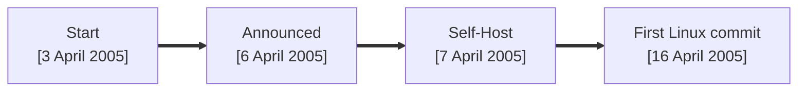

# Key Events

<div grid="~ cols-1" class="justify-items-center mt-30">



</div>

<!-- 
- Development began on **3 April 2005**.

- Torvalds announced the project on **6 April 2005**.

- Git became self-hosted on **7 April 2005**.
  ```
  commit e83c5163316f89bfbde7d9ab23ca2e25604af29
  Author: Linus Torvalds <torvalds@ppc970.osdl.org>
  Date:   Thu Apr 7 15:13:13 2005 -0700

  Initial revision of "git", the information manager from hell
  ```

- First Linux commit was maded on 16 April 2005
  ```
  commit 1da177e4c3f41524e886b7f1b8a0c1fc7321cac2
  Author: Linus Torvalds <torvalds@ppc970.osdl.org>
  Date:   Sat Apr 16 15:20:36 2005 -0700

  Linux-2.6.12-rc2

  Initial git repository build. I'm not bothering with the full history,
  even though we have it. We can create a separate "historical" git
  archive of that later if we want to, and in the meantime it's about
  3.2GB when imported into git - space that would just make the early
  git days unnecessarily complicated, when we don't have a lot of good
  infrastructure for it.

  Let it rip!
  ```

  ```
  17291 files changed, 6718755 insertions(+), 0 deletions(-)
  ```
-->