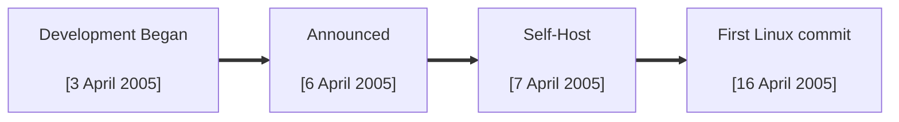

# Key Events

<div grid="~ cols-1" class="justify-items-center">

<div>



</div>

</div>


<div grid="~ cols-2 gap-4">

<v-click class="justify-items-left">

```
commit e83c5163316f89bfbde7d9ab23ca2e25604af29
Author: Linus Torvalds <torvalds@ppc970.osdl.org>
Date:   Thu Apr 7 15:13:13 2005 -0700

Initial revision of "git", the information manager from hell
```

</v-click>

<v-click class="text-xs">

```
commit 1da177e4c3f41524e886b7f1b8a0c1fc7321cac2
Author: Linus Torvalds <torvalds@ppc970.osdl.org>
Date:   Sat Apr 16 15:20:36 2005 -0700

Linux-2.6.12-rc2

Initial git repository build. I'm not bothering with the full history,
even though we have it. We can create a separate "historical" git
archive of that later if we want to, and in the meantime it's about
3.2GB when imported into git - space that would just make the early
git days unnecessarily complicated, when we don't have a lot of good
infrastructure for it.

Let it rip!
```

</v-click>

</div>

<!-- 
```
17291 files changed, 6718755 insertions(+), 0 deletions(-)
```
-->
